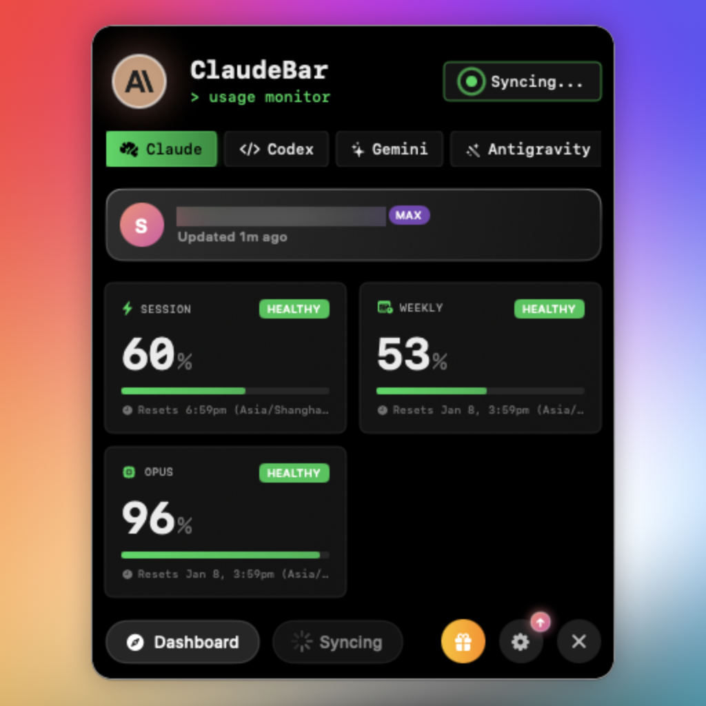

# ClaudeBar

[](https://github.com/tddworks/ClaudeBar/actions/workflows/build.yml)
[](https://github.com/tddworks/ClaudeBar/actions/workflows/tests.yml)
[](https://codecov.io/gh/tddworks/ClaudeBar)
[](https://github.com/tddworks/ClaudeBar/releases/latest)
[](https://swift.org)
[](https://developer.apple.com)
[](https://formulae.brew.sh/cask/claudebar)

A macOS menu bar application that monitors AI coding assistant usage quotas. Keep track of your Claude, Codex, Gemini, GitHub Copilot, Antigravity, Z.ai, Kimi, Kiro, Amp, OpenCode Go, Oh My Pi, and more at a glance.

<table align="center">
  <tr>
    <td align="center"><br/><em>Dark Mode</em></td>
    <td align="center"><br/><em>Light Mode</em></td>
  </tr>
  <tr>
    <td align="center"><br/><em>CLI Theme</em></td>
    <td align="center"><br/><em>Christmas Theme</em></td>
  </tr>
</table>

## Features

- **Multi-Provider Support** - Monitor Claude, Codex, Gemini, GitHub Copilot, Antigravity, Z.ai, Kimi, Kiro, Amp, OpenCode Go, and Oh My Pi quotas in one place
- **Provider Enable/Disable** - Toggle individual providers on/off from Settings to customize your monitoring
- **Real-Time Quota Tracking** - View Session, Weekly, and Model-specific usage percentages
- **Multiple Themes** - Light, Dark, CLI, Christmas, and [imported terminal themes](#import-terminal-theme) (.itermcolors)
- **Automatic Adaptation** - System theme follows your macOS appearance; Christmas auto-enables during the holiday season
- **Visual Status Indicators** - Color-coded progress bars (green/yellow/red) show quota health
- **System Notifications** - Get alerted when quota status changes to warning or critical
- **Auto-Refresh** - Automatically updates quotas at configurable intervals
- **Keyboard Shortcuts** - Quick access with `⌘D` (Dashboard) and `⌘R` (Refresh)

## Quota Status Thresholds

| Remaining | Status | Color |
|-----------|--------|-------|
| > 50% | Healthy | Green |
| 20-50% | Warning | Yellow |
| < 20% | Critical | Red |
| 0% | Depleted | Gray |

## Requirements

- macOS 15+
- Swift 6.2+
- CLI tools installed for providers you want to monitor:
  - [Claude CLI](https://claude.ai/code) (`claude`)
  - [Codex CLI](https://github.com/openai/codex) (`codex`)
  - [Gemini CLI](https://github.com/google-gemini/gemini-cli) (`gemini`)
  - [GitHub Copilot](https://github.com/features/copilot) - Configure credentials in Settings
  - [Antigravity](https://antigravity.google) - Auto-detected when running locally
  - [Z.ai](https://z.ai/subscribe) - Configure Claude Code with GLM Coding Plan endpoint
  - [Kimi](https://www.kimi.com/code/console) (`kimi`) - CLI mode (recommended) or API mode (see below)
  - [Kiro](https://kiro.dev) (`kiro-cli`) - Requires kiro-cli installation (see below)
  - [Amp](https://ampcode.com) (`amp`) - Auto-detected when CLI is installed
  - [OpenCode Go](https://opencode.ai/go) (`opencode`) - Tracks OpenCode Go usage windows (5hr/$12, weekly/$30, monthly/$60) via local SQLite DB
  - [Oh My Pi](https://omp.sh) (`omp`) - Aggregates account usage via `omp usage --json`, showing rate-limit windows and, where reported, capped USD money cards or uncapped spend notes

### Kimi Setup

Kimi supports two probe modes, configurable in **Settings > Kimi Configuration**:

**CLI Mode (Recommended)** - Launches the interactive `kimi` CLI and sends `/usage` to fetch quota data. Requires `kimi` CLI installed (`uv tool install kimi-cli`). No Full Disk Access needed.

**API Mode** - Calls the Kimi API directly using browser cookie authentication. Requires **Full Disk Access** for ClaudeBar to read the `kimi-auth` browser cookie:
1. Open **System Settings** > **Privacy & Security** > **Full Disk Access**
2. Toggle **ClaudeBar** on (or click `+` and add it)
3. Restart ClaudeBar

You can also set the `KIMI_AUTH_TOKEN` environment variable to bypass cookie reading in API mode.

### Kiro Setup

Kiro monitors AWS Kiro (formerly CodeWhisperer) usage through the `kiro-cli` command-line tool.

**Installation**: `uv tool install kiro-cli` or `pip install kiro-cli`

**Authentication**: Run `kiro-cli` and follow the login prompts.

**Kiro IDE Users**: If you use Kiro IDE, simply install kiro-cli. Both share the same authentication, so no additional login is required.

## Installation

### Homebrew

Install via [Homebrew](https://brew.sh).

```bash
brew install --cask claudebar
```

### Download (Recommended)

Download the latest release from [GitHub Releases](https://github.com/tddworks/ClaudeBar/releases/latest):

- **DMG**: Open and drag ClaudeBar.app to Applications
- **ZIP**: Unzip and move ClaudeBar.app to Applications

Both are code-signed and notarized for Gatekeeper.

### Build from Source

```bash
git clone https://github.com/tddworks/ClaudeBar.git
cd ClaudeBar

# Install Tuist (if not installed)
brew install tuist

# Install dependencies and build
tuist install
tuist build ClaudeBar -C Release
```

## Usage

After building, open the generated Xcode workspace and run the app:

```bash
tuist generate
open ClaudeBar.xcworkspace
```

Then press `Cmd+R` in Xcode to run. The app will appear in your menu bar. Click to view quota details for each provider.

## Development

The project uses [Tuist](https://tuist.io) for dependency management and Xcode project generation.

### Quick Start

```bash
# Install Tuist (if not installed)
brew install tuist

# Install dependencies
tuist install

# Generate Xcode project and open
tuist generate
open ClaudeBar.xcworkspace
```

### Build & Test

```bash
# Build the project
tuist build

# Run all tests
tuist test

# Run tests with coverage
tuist test --result-bundle-path TestResults.xcresult -- -enableCodeCoverage YES

# Build release configuration
tuist build ClaudeBar -C Release
```

### SwiftUI Previews

After opening in Xcode, SwiftUI previews will work with `Cmd+Option+Return`. The project is configured with `ENABLE_DEBUG_DYLIB` for preview support.

## Architecture

> **Full documentation:** [docs/ARCHITECTURE.md](docs/ARCHITECTURE.md)

ClaudeBar uses a **layered architecture** with `QuotaMonitor` as the single source of truth:

| Layer | Purpose |
|-------|---------|
| **App** | SwiftUI views consuming domain directly (no ViewModel) |
| **Domain** | Rich models, `QuotaMonitor`, repository protocols |
| **Infrastructure** | Probes, storage implementations, adapters |

### Key Design Decisions

- **Single Source of Truth** - `QuotaMonitor` owns all provider state
- **Repository Pattern** - Settings and credentials abstracted behind injectable protocols
- **Protocol-Based DI** - `@Mockable` protocols enable testability
- **Chicago School TDD** - Tests verify state changes, not method calls
- **No ViewModel/AppState** - Views consume domain directly

## Import Terminal Theme

Match ClaudeBar's appearance to your terminal. Import any `.itermcolors` file:

1. Open **Settings** (gear icon)
2. Click **Import .itermcolors**
3. Select your file (export from iTerm2: Preferences > Profiles > Colors > Color Presets > Export)

450+ pre-made schemes available at [iTerm2-Color-Schemes](https://github.com/mbadolato/iTerm2-Color-Schemes/tree/master/schemes).

Imported themes are saved in `~/.claudebar/themes/` and persist across restarts.

## Contributing

### Adding a New AI Provider

Use the **add-provider** skill to guide you through adding new providers with TDD:

```
Tell Claude Code: "I want to add a new provider for [ProviderName]"
```

The skill guides you through: Parsing Tests → Probe Tests → Implementation → Registration.

See `.claude/skills/add-provider/SKILL.md` for details and `AntigravityUsageProbe` as a reference implementation.

## Dependencies

- [Sparkle](https://sparkle-project.org/) - Auto-update framework
- [Mockable](https://github.com/Kolos65/Mockable) - Protocol mocking for tests
- [Tuist](https://tuist.io) - Xcode project generation (for SwiftUI previews)

## Releasing

Releases are automated via GitHub Actions. Push a version tag to create a new release.

**For detailed setup instructions, see [docs/release/RELEASE_SETUP.md](docs/release/RELEASE_SETUP.md).**

### Release Workflow

The workflow uses Tuist to generate the Xcode project:

```
Tag v1.0.0 → Update Info.plist → tuist generate → xcodebuild → Sign & Notarize → GitHub Release
```

Version is set in `Sources/App/Info.plist` and flows through to Sparkle auto-updates.

### Quick Start

1. **Configure GitHub Secrets** (see [full guide](docs/release/RELEASE_SETUP.md)):

   | Secret | Description |
   |--------|-------------|
   | `APPLE_CERTIFICATE_P12` | Developer ID certificate (base64) |
   | `APPLE_CERTIFICATE_PASSWORD` | Password for .p12 |
   | `APP_STORE_CONNECT_API_KEY_P8` | API key (base64) |
   | `APP_STORE_CONNECT_KEY_ID` | Key ID |
   | `APP_STORE_CONNECT_ISSUER_ID` | Issuer ID |

2. **Verify your certificate**:
   ```bash
   ./scripts/verify-p12.sh /path/to/certificate.p12
   ```

3. **Create a release**:
   ```bash
   git tag v1.0.0
   git push origin v1.0.0
   ```

The workflow will automatically build, sign, notarize, and publish to GitHub Releases.

## Contributors

Thanks to everyone who has contributed to ClaudeBar!

<table>
  <tr>
    <td align="center"><a href="https://github.com/hanrw"><br/><sub><b>hanrw</b></sub></a></td>
    <td align="center"><a href="https://github.com/ramarivera"><br/><sub><b>ramarivera</b></sub></a></td>
    <td align="center"><a href="https://github.com/zenibako"><br/><sub><b>zenibako</b></sub></a></td>
    <td align="center"><a href="https://github.com/AlexanderWillner"><br/><sub><b>AlexanderWillner</b></sub></a></td>
    <td align="center"><a href="https://github.com/avishj"><br/><sub><b>avishj</b></sub></a></td>
    <td align="center"><a href="https://github.com/BryanQQYue"><br/><sub><b>BryanQQYue</b></sub></a></td>
  </tr>
  <tr>
    <td align="center"><a href="https://github.com/frankhommers"><br/><sub><b>frankhommers</b></sub></a></td>
    <td align="center"><a href="https://github.com/hagiwaratakayuki"><br/><sub><b>hagiwaratakayuki</b></sub></a></td>
    <td align="center"><a href="https://github.com/tomstetson"><br/><sub><b>tomstetson</b></sub></a></td>
    <td align="center"><a href="https://github.com/logancox"><br/><sub><b>logancox</b></sub></a></td>
    <td align="center"><a href="https://github.com/hansonkim"><br/><sub><b>hansonkim</b></sub></a></td>
    <td align="center"><a href="https://github.com/farmdawgnation"><br/><sub><b>farmdawgnation</b></sub></a></td>
  </tr>
  <tr>
    <td align="center"><a href="https://github.com/sailesh"><br/><sub><b>sailesh</b></sub></a></td>
    <td align="center"><a href="https://github.com/billyjack2"><br/><sub><b>billyjack2</b></sub></a></td>
    <td align="center"><a href="https://github.com/nero-sensei"><br/><sub><b>nero-sensei</b></sub></a></td>
    <td align="center"><a href="https://github.com/marcusquinn"><br/><sub><b>marcusquinn</b></sub></a></td>
    <td align="center"><a href="https://github.com/jeffscottmtl"><br/><sub><b>jeffscottmtl</b></sub></a></td>
    <td align="center"><a href="https://github.com/LunarECL"><br/><sub><b>LunarECL</b></sub></a></td>
  </tr>
  <tr>
    <td align="center"><a href="https://github.com/jeffWelling"><br/><sub><b>jeffWelling</b></sub></a></td>
    <td align="center"><a href="https://github.com/Zada5"><br/><sub><b>Zada5</b></sub></a></td>
    <td align="center"><a href="https://github.com/fredericoricco-debug"><br/><sub><b>fredericoricco-debug</b></sub></a></td>
    <td align="center"><a href="https://github.com/benjaminbelaga"><br/><sub><b>benjaminbelaga</b></sub></a></td>
    <td align="center"><a href="https://github.com/y5mei"><br/><sub><b>y5mei</b></sub></a></td>
    <td align="center"><a href="https://github.com/josecancino"><br/><sub><b>josecancino</b></sub></a></td>
  </tr>
  <tr>
    <td align="center"><a href="https://github.com/isnakolah"><br/><sub><b>isnakolah</b></sub></a></td>
    <td align="center"><a href="https://github.com/Mitsi-ag"><br/><sub><b>Mitsi-ag</b></sub></a></td>
  </tr>
</table>

## License

MIT
