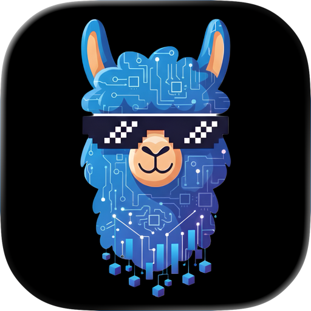

#  ClaudeBar

**Every AI coding quota in your menu bar.**

[](https://github.com/tddworks/ClaudeBar/actions/workflows/build.yml)
[](https://github.com/tddworks/ClaudeBar/actions/workflows/tests.yml)
[](https://codecov.io/gh/tddworks/ClaudeBar)
[](https://github.com/tddworks/ClaudeBar/releases/latest)
[](https://swift.org)
[](https://developer.apple.com)
[](https://formulae.brew.sh/cask/claudebar)

A macOS menu bar app that shows how much of your AI coding quota is left — Claude, Codex, Gemini, Copilot, Cursor and 15 more — with reset countdowns and a notification before you run out.

<table align="center">
  <tr>
    <td align="center"><br/><em>Dark</em></td>
    <td align="center"><br/><em>Light</em></td>
  </tr>
</table>

## Quick Start

```bash
brew install --cask claudebar
```

Or download the signed and notarized DMG from [Releases](https://github.com/tddworks/ClaudeBar/releases/latest). Requires macOS 15+. Launch it, open **Settings → Providers** and turn on the tools you use; each provider's doc says what it needs. Building from source: [CONTRIBUTING.md](CONTRIBUTING.md).

## Providers

| Provider | Tracks | Setup |
|---|---|---|
| Claude | 5-hour session and weekly limits, model limits (Opus, Sonnet, Fable), Extra Usage | [docs](docs/providers/claude/README.md) |
| Codex | 5-hour and weekly rate limits, credits | [docs](docs/providers/codex/README.md) |
| Gemini | Per-model Code Assist quota (Pro, Flash, Flash Lite) | [docs](docs/providers/gemini/README.md) |
| Antigravity | Gemini and Claude pools, 5-hour and weekly | [docs](docs/providers/antigravity/README.md) |
| Z.ai | GLM Coding Plan 5-hour, weekly, monthly and MCP usage | [docs](docs/providers/zai/README.md) |
| Copilot | Monthly AI credits | [docs](docs/providers/copilot/README.md) |
| AWS Bedrock | Today's spend and tokens per model, optional daily budget | [docs](docs/providers/bedrock/README.md) |
| Amp Code | Free allowance and credit balance | [docs](docs/providers/ampcode/README.md) |
| Kimi | 5-hour and weekly limits | [docs](docs/providers/kimi/README.md) |
| Kiro | Monthly plan credits and bonus credits | [docs](docs/providers/kiro/README.md) |
| Cursor | Included monthly usage, on-demand and team credits | [docs](docs/providers/cursor/README.md) |
| MiniMax | Coding Plan requests per model | [docs](docs/providers/minimax/README.md) |
| DeepSeek | Account balance (paid and granted) | [docs](docs/providers/deepseek/README.md) |
| OpenRouter | Credit balance (credits minus usage) | [docs](docs/providers/openrouter/README.md) |
| Vercel Gateway | AI Gateway credit balance | [docs](docs/providers/vercel-gateway/README.md) |
| Alibaba | Coding Plan 5-hour, weekly and monthly quota | [docs](docs/providers/alibaba/README.md) |
| Mistral | Today's Mistral Vibe spend and tokens | [docs](docs/providers/mistral/README.md) |
| OpenCode Go | 5-hour, weekly and monthly windows | [docs](docs/providers/opencode-go/README.md) |
| Oh My Pi | Every rate-limit window `omp` reports, per upstream account, and daily usage from its session logs | [docs](docs/providers/omp/README.md) |
| Grok | xAI credit allowance per billing period, per product, plan and prepaid balance | [docs](docs/providers/grok/README.md) |
| Command Code | 5-hour and weekly windows, credit balance | [docs](docs/providers/commandcode/README.md) |
| Cline | Five-hour, weekly and monthly plan limits | [docs](docs/providers/cline/README.md) |
| Warp | Monthly AI credits and add-on credits | [docs](docs/providers/warp/README.md) |
| Devin | Daily and weekly organization quota, with your browser sign-in | [docs](docs/providers/devin/README.md) |
| Windsurf | Daily and weekly quota, or message and flow-action allowances | [docs](docs/providers/windsurf/README.md) |
| JetBrains AI | Monthly AI credits from your IDE | [docs](docs/providers/jetbrains/README.md) |
| OpenAI API | Organization spend over the last 30 days, per line item | [docs](docs/providers/openai/README.md) |
| Your own | Anything a script can print, via `~/.claudebar/extensions/` | [docs](docs/features/extensions/README.md) |

## What It Covers

| Area | What you can do |
|---|---|
| Menu bar | Up to three providers as a percentage and reset countdown, or a status icon → [docs](docs/features/menu-bar/README.md) |
| [Multiple Codex accounts](docs/features/multi-account/README.md) | Separate logins, identified by email, with independent quotas |
| Alerts & colors | Healthy, warning, critical and depleted levels, pace-aware colors, custom colors and High Contrast → [docs](docs/features/status-colors/README.md) |
| Notch | Quota and live Claude Code sessions in the MacBook notch → [docs](docs/features/notch/README.md) |
| Touch Bar | Quota gauges on a MacBook Pro Touch Bar → [docs](docs/features/touch-bar/README.md) |
| Notify! | Quota on your iPhone Lock Screen and Home Screen → [docs](docs/features/notify/README.md) |
| Session hooks | Claude Code Started / Finished notifications → [docs](docs/features/session-hooks/README.md) |
| Daily usage | Today's cost and tokens next to yesterday's → [docs](docs/features/daily-usage/README.md) |
| Leaderboard | Share daily token totals and see where you rank → [docs](docs/features/leaderboard/README.md) |
| Themes | Dark, Light, CLI, Christmas, Pop, or your terminal's `.itermcolors` → [docs](docs/features/themes/README.md) |
| Extensions | Add any quota source with a manifest and a script → [docs](docs/features/extensions/README.md) |
| URL schemes | `claudebar://` actions for Raycast, Alfred and scripts → [docs](docs/features/url-schemes/README.md) |

Every doc, one line each: [docs index](docs/README.md). Something not working: [troubleshooting](docs/troubleshooting.md).

## More

- [Contributing](CONTRIBUTING.md) — build, test, and where things go
- [Architecture](docs/architecture/ARCHITECTURE.md) — layers and data flow
- [Changelog](CHANGELOG.md)

## Sponsors

Apps that use and support ClaudeBar development:

<a href="https://appnexus.app">
  
  <br>
  <b>AppNexus for App Store Connect</b>
</a>

## Contributors

Thanks goes to these wonderful people ([emoji key](https://allcontributors.org/docs/en/emoji-key)):

<!-- ALL-CONTRIBUTORS-LIST:START - Do not remove or modify this section -->
<!-- prettier-ignore-start -->
<!-- markdownlint-disable -->
<table>
  <tbody>
    <tr>
      <td align="center" valign="top" width="16.66%"><a href="https://tddworks.com/"><br /><sub><b>itshan</b></sub></a><br /><a href="https://github.com/tddworks/claudebar/commits?author=hanrw" title="Code">💻</a> <a href="https://github.com/tddworks/claudebar/commits?author=hanrw" title="Documentation">📖</a> <a href="#maintenance-hanrw" title="Maintenance">🚧</a></td>
      <td align="center" valign="top" width="16.66%"><a href="https://github.com/avishj"><br /><sub><b>Avish Jha</b></sub></a><br /><a href="https://github.com/tddworks/claudebar/commits?author=avishj" title="Code">💻</a></td>
      <td align="center" valign="top" width="16.66%"><a href="https://github.com/ramarivera"><br /><sub><b>Ramiro</b></sub></a><br /><a href="https://github.com/tddworks/claudebar/commits?author=ramarivera" title="Code">💻</a></td>
      <td align="center" valign="top" width="16.66%"><a href="https://github.com/LunarECL"><br /><sub><b>LunarECL</b></sub></a><br /><a href="https://github.com/tddworks/claudebar/commits?author=LunarECL" title="Code">💻</a></td>
      <td align="center" valign="top" width="16.66%"><a href="https://github.com/zenibako"><br /><sub><b>Chandler Anderson</b></sub></a><br /><a href="https://github.com/tddworks/claudebar/commits?author=zenibako" title="Code">💻</a></td>
      <td align="center" valign="top" width="16.66%"><a href="https://frmr.me"><br /><sub><b>Matt Farmer</b></sub></a><br /><a href="https://github.com/tddworks/claudebar/commits?author=farmdawgnation" title="Code">💻</a></td>
    </tr>
    <tr>
      <td align="center" valign="top" width="16.66%"><a href="https://willner.ws"><br /><sub><b>Alex</b></sub></a><br /><a href="https://github.com/tddworks/claudebar/commits?author=AlexanderWillner" title="Code">💻</a></td>
      <td align="center" valign="top" width="16.66%"><a href="https://github.com/sailesh"><br /><sub><b>sailesh</b></sub></a><br /><a href="https://github.com/tddworks/claudebar/commits?author=sailesh" title="Code">💻</a></td>
      <td align="center" valign="top" width="16.66%"><a href="https://github.com/billyjack2"><br /><sub><b>Billy Smith</b></sub></a><br /><a href="https://github.com/tddworks/claudebar/commits?author=billyjack2" title="Code">💻</a></td>
      <td align="center" valign="top" width="16.66%"><a href="https://github.com/nero-sensei"><br /><sub><b>nero</b></sub></a><br /><a href="https://github.com/tddworks/claudebar/commits?author=nero-sensei" title="Code">💻</a></td>
      <td align="center" valign="top" width="16.66%"><a href="https://github.com/BryanQQYue"><br /><sub><b>BryanYue</b></sub></a><br /><a href="https://github.com/tddworks/claudebar/commits?author=BryanQQYue" title="Code">💻</a></td>
      <td align="center" valign="top" width="16.66%"><a href="https://blog.d0zingcat.dev/"><br /><sub><b>Tony Tang</b></sub></a><br /><a href="https://github.com/tddworks/claudebar/commits?author=d0zingcat" title="Code">💻</a></td>
    </tr>
    <tr>
      <td align="center" valign="top" width="16.66%"><a href="https://initialize.nl/"><br /><sub><b>Frank Hommers</b></sub></a><br /><a href="https://github.com/tddworks/claudebar/commits?author=frankhommers" title="Code">💻</a></td>
      <td align="center" valign="top" width="16.66%"><a href="https://www.marcusquinn.com"><br /><sub><b>Marcus Quinn</b></sub></a><br /><a href="https://github.com/tddworks/claudebar/commits?author=marcusquinn" title="Code">💻</a></td>
      <td align="center" valign="top" width="16.66%"><a href="https://github.com/hagiwaratakayuki"><br /><sub><b>hagiwara takayuki</b></sub></a><br /><a href="https://github.com/tddworks/claudebar/commits?author=hagiwaratakayuki" title="Code">💻</a></td>
      <td align="center" valign="top" width="16.66%"><a href="https://github.com/jeffscottmtl"><br /><sub><b>jeffscottmtl</b></sub></a><br /><a href="https://github.com/tddworks/claudebar/commits?author=jeffscottmtl" title="Code">💻</a></td>
      <td align="center" valign="top" width="16.66%"><a href="https://github.com/tomstetson"><br /><sub><b>Tom</b></sub></a><br /><a href="https://github.com/tddworks/claudebar/commits?author=tomstetson" title="Code">💻</a></td>
      <td align="center" valign="top" width="16.66%"><a href="https://github.com/jeffWelling"><br /><sub><b>Jeff Welling</b></sub></a><br /><a href="https://github.com/tddworks/claudebar/commits?author=jeffWelling" title="Code">💻</a></td>
    </tr>
    <tr>
      <td align="center" valign="top" width="16.66%"><a href="https://github.com/Zada5"><br /><sub><b>Zada5</b></sub></a><br /><a href="https://github.com/tddworks/claudebar/commits?author=Zada5" title="Code">💻</a></td>
      <td align="center" valign="top" width="16.66%"><a href="https://github.com/fredericoricco-debug"><br /><sub><b>fredericoricco-debug</b></sub></a><br /><a href="https://github.com/tddworks/claudebar/commits?author=fredericoricco-debug" title="Code">💻</a></td>
      <td align="center" valign="top" width="16.66%"><a href="https://lystic.dev"><br /><sub><b>Kegan Hollern</b></sub></a><br /><a href="https://github.com/tddworks/claudebar/commits?author=KeganHollern" title="Code">💻</a></td>
      <td align="center" valign="top" width="16.66%"><a href="https://github.com/jsg333"><br /><sub><b>Jeff Green</b></sub></a><br /><a href="https://github.com/tddworks/claudebar/commits?author=jsg333" title="Code">💻</a></td>
      <td align="center" valign="top" width="16.66%"><a href="https://github.com/benjaminbelaga"><br /><sub><b>Benjamin Belaga</b></sub></a><br /><a href="https://github.com/tddworks/claudebar/commits?author=benjaminbelaga" title="Code">💻</a></td>
      <td align="center" valign="top" width="16.66%"><a href="https://github.com/romanvalent"><br /><sub><b>romanvalent</b></sub></a><br /><a href="https://github.com/tddworks/claudebar/commits?author=romanvalent" title="Code">💻</a></td>
    </tr>
    <tr>
      <td align="center" valign="top" width="16.66%"><a href="http://aakshintala.com"><br /><sub><b>Amogh Akshintala</b></sub></a><br /><a href="https://github.com/tddworks/claudebar/commits?author=aakshintala" title="Code">💻</a></td>
      <td align="center" valign="top" width="16.66%"><a href="https://www.portfolio.isnakolah.me"><br /><sub><b>Daniel Nakolah</b></sub></a><br /><a href="https://github.com/tddworks/claudebar/commits?author=isnakolah" title="Code">💻</a></td>
      <td align="center" valign="top" width="16.66%"><a href="https://github.com/Mitsi-ag"><br /><sub><b>Mitsi-ag</b></sub></a><br /><a href="https://github.com/tddworks/claudebar/commits?author=Mitsi-ag" title="Code">💻</a></td>
      <td align="center" valign="top" width="16.66%"><a href="https://www.josecancinolinares.com/en/portfolio"><br /><sub><b>José Cancino Linares</b></sub></a><br /><a href="https://github.com/tddworks/claudebar/commits?author=josecancino" title="Code">💻</a></td>
      <td align="center" valign="top" width="16.66%"><a href="https://github.com/logancox"><br /><sub><b>logancox</b></sub></a><br /><a href="https://github.com/tddworks/claudebar/commits?author=logancox" title="Code">💻</a></td>
      <td align="center" valign="top" width="16.66%"><a href="http://ywmei.ca/index.php"><br /><sub><b>y5mei</b></sub></a><br /><a href="https://github.com/tddworks/claudebar/commits?author=y5mei" title="Code">💻</a></td>
    </tr>
    <tr>
      <td align="center" valign="top" width="16.66%"><a href="https://hansonkim.github.io"><br /><sub><b>Hanson Kim</b></sub></a><br /><a href="https://github.com/tddworks/claudebar/commits?author=hansonkim" title="Code">💻</a></td>
      <td align="center" valign="top" width="16.66%"><a href="https://github.com/jsvisa"><br /><sub><b>Delweng</b></sub></a><br /><a href="https://github.com/tddworks/claudebar/commits?author=jsvisa" title="Code">💻</a></td>
      <td align="center" valign="top" width="16.66%"><a href="https://github.com/SridarDhandapani"><br /><sub><b>Sridar Dhandapani</b></sub></a><br /><a href="https://github.com/tddworks/claudebar/commits?author=SridarDhandapani" title="Code">💻</a></td>
      <td align="center" valign="top" width="16.66%"><a href="https://weavr.care/"><br /><sub><b>Seunghwan Kim</b></sub></a><br /><a href="https://github.com/tddworks/claudebar/commits?author=shwankim7" title="Code">💻</a></td>
      <td align="center" valign="top" width="16.66%"><a href="https://rasterfactory.com/"><br /><sub><b>Ryan</b></sub></a><br /><a href="https://github.com/tddworks/claudebar/commits?author=rasterfactory" title="Code">💻</a></td>
      <td align="center" valign="top" width="16.66%"><a href="https://www.akeeba.com/"><br /><sub><b>Nicholas K. Dionysopoulos</b></sub></a><br /><a href="https://github.com/tddworks/claudebar/commits?author=nikosdion" title="Code">💻</a></td>
    </tr>
    <tr>
      <td align="center" valign="top" width="16.66%"><a href="https://github.com/jzd101"><br /><sub><b>jzd101</b></sub></a><br /><a href="https://github.com/tddworks/claudebar/commits?author=jzd101" title="Code">💻</a></td>
      <td align="center" valign="top" width="16.66%"><a href="https://github.com/hubert-alch"><br /><sub><b>Hubert</b></sub></a><br /><a href="https://github.com/tddworks/claudebar/commits?author=hubert-alch" title="Code">💻</a></td>
      <td align="center" valign="top" width="16.66%"><a href="https://pingie.com/"><br /><sub><b>simplytoast1</b></sub></a><br /><a href="https://github.com/tddworks/claudebar/commits?author=simplytoast1" title="Code">💻</a></td>
      <td align="center" valign="top" width="16.66%"><a href="https://github.com/cszhe"><br /><sub><b>Jason He</b></sub></a><br /><a href="https://github.com/tddworks/claudebar/commits?author=cszhe" title="Code">💻</a></td>
      <td align="center" valign="top" width="16.66%"><a href="https://github.com/arkad-cm"><br /><sub><b>Arkadev Banerjee</b></sub></a><br /><a href="https://github.com/tddworks/claudebar/commits?author=arkad-cm" title="Code">💻</a></td>
      <td align="center" valign="top" width="16.66%"><a href="https://github.com/shoo99"><br /><sub><b>shoo99</b></sub></a><br /><a href="https://github.com/tddworks/claudebar/commits?author=shoo99" title="Code">💻</a></td>
    </tr>
    <tr>
      <td align="center" valign="top" width="16.66%"><a href="https://github.com/joakimt90"><br /><sub><b>joakimt90</b></sub></a><br /><a href="https://github.com/tddworks/claudebar/commits?author=joakimt90" title="Code">💻</a></td>
      <td align="center" valign="top" width="16.66%"><a href="https://roy-tong.github.io/"><br /><sub><b>Roy Tong</b></sub></a><br /><a href="https://github.com/tddworks/claudebar/commits?author=roy-tong" title="Code">💻</a></td>
      <td align="center" valign="top" width="16.66%"><a href="https://github.com/nhonn"><br /><sub><b>Noah</b></sub></a><br /><a href="https://github.com/tddworks/claudebar/commits?author=nhonn" title="Code">💻</a></td>
      <td align="center" valign="top" width="16.66%"><a href="https://github.com/NicholasLea"><br /><sub><b>Nicholas</b></sub></a><br /><a href="https://github.com/tddworks/claudebar/commits?author=NicholasLea" title="Code">💻</a></td>
      <td align="center" valign="top" width="16.66%"><a href="https://github.com/JawsomeJason"><br /><sub><b>Jason Featheringham ⊙ω⊙</b></sub></a><br /><a href="https://github.com/tddworks/claudebar/commits?author=JawsomeJason" title="Code">💻</a></td>
      <td align="center" valign="top" width="16.66%"><a href="https://github.com/brandonpierce"><br /><sub><b>Brandon Pierce</b></sub></a><br /><a href="https://github.com/tddworks/claudebar/commits?author=brandonpierce" title="Code">💻</a></td>
    </tr>
  </tbody>
  <tfoot>
    <tr>
      <td align="center" size="13px" colspan="6">
        
          <a href="https://all-contributors.js.org/docs/en/bot/usage">Add your contributions</a>
        </img>
      </td>
    </tr>
  </tfoot>
</table>

<!-- markdownlint-restore -->
<!-- prettier-ignore-end -->

<!-- ALL-CONTRIBUTORS-LIST:END -->
<!-- markdownlint-restore -->
<!-- prettier-ignore-end -->

This project follows the [all-contributors](https://github.com/all-contributors/all-contributors) specification. Contributions of any kind welcome!

To credit someone, comment on any issue or pull request:

```
@all-contributors please add @username for code, doc
```

## License

Apache License 2.0. See [LICENSE](LICENSE) and [NOTICE](NOTICE).

The notch view uses [matrix-swift](https://github.com/mana-am/matrix-swift), which has its own license: you may use it in an app, but not republish its components as a standalone library.
