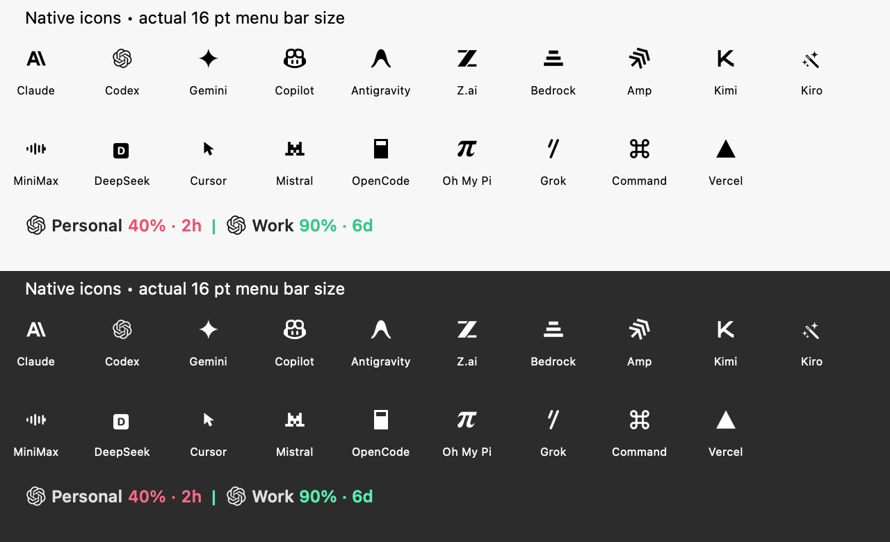

# Menu Bar

The menu bar item can show a live readout for up to three providers, so you can check a quota without opening the popover. With the readout off, it shows a status icon tinted by the selected provider's overall status.

Apple calls an app's item on the right of the menu bar a **menu bar extra** (in AppKit code, an `NSStatusItem`). What ClaudeBar draws in it is its **label**: one readout per selected provider, like `5h 81% · 2:58 | Fable 100% · 16:58`.

## Quick start

1. Settings → **Menu Bar**.
2. Turn on **Show Percentage in Menu Bar**, **Show Duration in Menu Bar**, or both.
3. Under **Providers**, pick up to three (`n / 3 selected`). Each one then gets its own card below.
4. In each provider's card, pick the **Quota** to show and, if you like, a **Secondary Quota**.

The Providers card only appears once percentage or duration is on. Only providers enabled under Settings → Providers are offered.

## What the label shows

| Setting | Label |
|---|---|
| Both off | Status icon only (bar chart, triangle when critical), no numbers |
| Percentage | `62%` |
| Duration | `4:40` |
| Both | `62% · 4:40` |
| With a secondary quota | `5h 62% · 4:40 \| 7d 34% · 2d` |

- **Quota Display** (top of the pane) picks what the percentage means: remaining or used. The third, gauge-icon choice is Pace: popover cards show "Running hot" / "On track" / "Room to spare", and the menu bar shows the remaining percentage.
- With two windows, each one starts with a short name: `5h` for a session window, `7d` for a weekly one, or the quota's own name (`Fable`, `Opus`) — see [Name your own label](#name-your-own-label). The label takes the worse of the two statuses, and **Stack in Menu Bar** draws them as two smaller lines with their own colors. Stacked text comes in Small, Medium or Large.
- With more than one provider, each readout starts with that provider's logo, separated by `|`. Hover the item to see a tooltip with the provider names.
- With a single provider and a single account there's nothing to tell apart, so by default the readout has no logo, only the numbers. Turn on **Show Provider Logo** (Settings → Menu Bar) to start it with the logo anyway. A logo always appears with a second provider, or when the provider has several enabled accounts (with the account's short name when **Show Names for Multiple Accounts** is on). [Native menu bar icons](#native-menu-bar-icons) changes which logo is drawn, not whether one is.
- **Show Names for Multiple Accounts** shows short account names beside provider icons when the same provider has more than one enabled account. Turn it off to hide those names and save space. Single accounts never show an account name, regardless of this setting. The hover tooltip shows provider names and quota information; it does not identify a single account.
- The color of each readout follows its quota status; see [status colors](../status-colors/README.md).

## Name your own label

The readout is built from your choices, so "your own label" is two things: which quotas it shows, and what they're called.

**What it shows** — Settings → **Menu Bar**: turn on percentage and/or duration, pick up to three providers, and give each a **Quota** and an optional **Secondary Quota**. For example, Claude's 5-hour window plus its Fable weekly window gives `5h 81% · 2:58 | Fable 100% · 16:58`.

**What each window is called** comes from the quota's kind, the same for every provider:

| Quota kind | Shown as |
|---|---|
| session | `5h` |
| weekly | `7d` |
| a model's quota | its name, capitalised (`Fable`, `Opus`) |
| any other time limit | its name |

A few built-in providers give a window a clearer name of their own (Antigravity shows `Gemini` / `Gemini Weekly` instead of `5h` / `7d`).

**For a provider you add yourself**, the names come from how its quotas are declared, so keep them short — the menu bar has little room:

- **Add Provider** (a JSON definition): each quota's `type` (`session`, `weekly`, `model`, `time`) and, for `model` and `time`, its `name`.
- **An extension**: each quota's `type` — `session`, `weekly`, `model:<name>`, or any other text, which becomes its own time-limited quota ([manifest](../extensions/manifest.md)).

The colour follows each quota's status; the label as a whole takes the worse of its two windows.

## Under the Pop theme

With the [Pop theme](../themes/README.md), each provider's readout is drawn as a **candy chip**: a pill in its status colour (mint, butter, coral) with an ink outline and ink text, readable on a light or a dark menu bar. Chips stand on their own, so there's no `|` between providers. A stacked (two-line) readout has no room for a chip and stays as text.

## Native menu bar icons

Settings → **Appearance** → **Native menu bar icons** replaces colored provider tiles with monochrome marks for every account in the menu bar. It is off by default. The marks switch between dark and light ink using the menu bar's actual appearance, including when the wallpaper gives the bar a different appearance from the app's theme.

Quota/status colors, account labels, and the popover's provider artwork keep their current appearance. Providers without a prepared logo mask, including custom providers and extensions, use their configured SF Symbol in the same monochrome ink.

*Examples rendered with the menu bar drawing code at 16 pt, using sample quotas; these are not screenshots of the macOS menu bar.*

### Maintaining icon artwork

The renderer looks for `<iconAssetName>MenuBar` in the asset catalog, then falls back to the provider's existing SF Symbol. This also covers added account IDs through the shared visual identity lookup; no provider-specific rendering code is needed.

Masks remove colored tile backgrounds and preserve the mark's transparent holes. Marking a full-color tile as a template would produce a solid square. The prepared assets are generated by [`scripts/generate-menu-bar-icons.py`](../../../scripts/generate-menu-bar-icons.py) from existing artwork, with a small-size Copilot vector from GitHub Primer Octicons (license included). Regenerate with Pillow installed and inspect the results in both appearances when updating a source. OpenCode's two-tone window uses a prepared outline. Runtime rendering performs no foreground detection.

The final status item image includes colored quota text, so it remains non-template. The renderer tints just the prepared mark before compositing, using the status button's appearance already observed by `StatusItemLabelDriver`. Setting and appearance changes invalidate the rendered content immediately.

## Countdown format

The duration is the time until the quota window resets:

| Time left | Shown as |
|---|---|
| A day or more | `2d` |
| 1 to 24 hours | `4:40` (hours:minutes) |
| 1 to 59 minutes | `45m` |
| Under a minute | `soon` |
| Unknown | `—` |

The countdown updates on its own every half second while a duration is shown, and in the `H:MM` range the colon pulses so you can see it's live. The design is in [countdown-colon.md](countdown-colon.md).

## Several providers

- The first provider you select is the primary one. You can't deselect the last one, and a fourth can't be added until you remove one.
- Each provider keeps its own quota, secondary quota and stacking choice. Removing a provider from the menu bar doesn't clear them; select it again and they come back.
- A selected provider that you turn off under Settings → Providers stays selected but drops out of the label. Its card says "Enable this provider in Providers to show its usage."
- A provider that's selected but has no data yet shows `—`. Its card says "Waiting for quota data… Your choices are saved."
- If the saved quota disappears from a provider (a plan change, a renamed window), the card says "The saved quota is unavailable. Choose another quota below."

## Gotchas

- **Background refresh is off by default.** With Settings → **Sync & Alerts** → Refresh Interval set to Off, the numbers update only when you open the popover. Choose 1, 5, 10 or 15 minutes to keep the menu bar current. Background refresh covers only the menu bar providers and the selected one.
- The countdown ticks between refreshes, but the percentage only changes when a refresh arrives.
- With **Burn Rate Warnings** on (Settings → General), the colors follow your consumption pace, not the fixed thresholds.
- While a Claude Code session is working, a terminal glyph appears in front of the readout. It needs [session hooks](../session-hooks/README.md).

## See also

[countdown-colon.md](countdown-colon.md) · [status colors](../status-colors/README.md) · [themes](../themes/README.md) · [Touch Bar](../touch-bar/README.md) · [notch](../notch/README.md)
